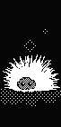
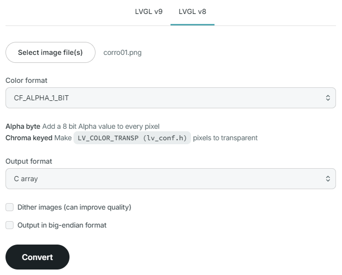

# Urchin Peripheral Animation

This repo will attempt to serve as both an example and a tutorial on adding custom art and animations to your zmk firmware nice!view equipped keyboard. 

For the purposes of this tutorial I will assume you have a split keyboard with two nice!views, and like me, you've slowly tired of the balloon/mountain artwork (though beautiful) that statically displays on your right keeb and you want to spice things up a little. 

The right side of your split keyboard is called the peripheral side. For the time being, (PR's in the works?) it's pretty dumb and doesn't have access to as much data as the left side does which is why the right side only has a battery indicator, connectivity indicator and some art. This is also why the battery lasts much longer, it's simply doing much less. So without access to much data, displaying art / animations is kinda the best we can do with the peripheral side. I say this to hamper any "can I put a bongo cat on the right side that reacts to wpm?" like questions which were my first questions too. Unfortunately no, that's left hand business. The peripheral isn't going to react to inputs because it simply can't.

If you just want to use my custom urchin animation and don't care how to make your own, you can jump straight down to [Usage](#usage)

---

#### Table of Contents
1. [What are we making](#what-are-we-making)
2. [Getting Started](#getting-started)
3. [Making the Art](#making-the-art)
4. [Converting Your Art](#converting-your-art)
5. [Brief Explanation of the Module](#brief-explanation-of-the-module)
6. [Adding a Static Image](#adding-a-static-image)
7. [Adding an Animation](#adding-an-animation)
8. [Using the Module](#usage)
9. [References](#references)

---


## What are we making?

Ultimately we are going to implement a 12 frame animation of the unofficial Rust-lang unsafe code mascot, Corro the sea urchin.

Why? Because my main keyboard right now is [duckyb's variant of the ferris sweep that uses the nice!view displays, called the urchin](https://github.com/duckyb/urchin). It's emblazoned with a cute little corro graphic on the pcb. 


---

*Sidenote: I bought mine from [beekeeb](https://shop.beekeeb.com/product/soldered-urchin-wireless-split-keyboard/) and I would recommend them for your nice!view equipped keyboard needs. I'm in no way affiliated with them, just a happy customer.*

---

So, I took this little dude and made a little 1bit animation that looks like this:



and then I put it on the urchin board like this:


If that seems like something you'd like to do, keep reading...


## Getting Started

Step one is to Fork or Clone this nice!view module repo: [https://github.com/GPeye/nice-view-mod](https://github.com/GPeye/nice-view-mod)

That repo is an exact copy of the same nice!view shield found in the official ZMK firmware repo, just wrapped up in a module.

**What's a module?** In a nutshell, it's a way of extending the ZMK firmware, allowing you to inject during build, new shields, boards, behaviors, features, drivers and more.

**But the nice!view shield is already in the firmware, why make it a module?** This way we can edit our forked/cloned module and just swap out the real nice!view shield for our custom one and we don't have to edit the official firmware.

Once you have your fork/clone, we'll need some art...


## Making the Art

*For just learning the code part of this, feel free to use the assets under the assets folder in this repo and skip this step*

The current nice!view peripheral mountain and balloon images are **68px wide by 140px tall** (sort've*) so, to easily swap out for some other art, any image we want to make or use should also be that size. I use aseprite which is a paid software, but pixel art at this size can easily be made in gimp or ms paint for free, or even using in browser tools like [piskel](https://www.piskelapp.com/p/create/sprite) or [pixilart](https://www.pixilart.com/draw) which even have helpers for creating animation.

Use **only** black and white to create your art as the nice!view does not support grayscale or any colors. You may want to get familiar with dithering. Here are a couple good resources: [what is it](https://pixelparmesan.com/dithering-for-pixel-artists/) and [a massive library of 1bit patterns](https://dev.crankit.app/tools/gfxp/)

⚠️ *forewarning, converting your art to the necessary C arrays is somewhat tedious so, maybe don't make a lot of animation frames. My urchin is 12 frames and it's was bordering on annoying to do* 😅

Regardless of the tool you are using, you will want to export your art to a png format. If you created an animation you will want to export each frame as an individual png rather than as a spritesheet.

Check out the `/assets/urchinpngart` folder for my example urchin 68x140 1-bit pixel art.

## Converting Your Art

**The first step is** to take your 68x140 art and make it 140x68 by **rotating it 90 degrees clockwise**.

**Why?** the nice!view is not a vertical display, it's actually a horizontal display that's usually in a vertical orientation because it fits better on a keyboard that way. If you've ever built your firmware with the default ZMK display status screen you may have noticed this as the battery and connection widget will be sideways.

Once you have rotated all your art, we need to convert it to a lvgl C array by heading to https://lvgl.io/tools/imageconverter and selecting your images, one at a time, and converting them by selecting LVGL v8, Color Format: `CF_ALPHA_1_BIT` and output format as `C array`



In the end you should end up with a bunch of C files, one for each image or frame of animation you have.

Check out the `/assets/urchincart` folder for my example c array files for the urchin pixel art.

## Brief Explanation of the Module

Feel free to skip this if you don't care but I thought it might be helpful to some to understand the files in this shield module and what they do.

<details>
<summary>Expand to see explanation</summary>

### nice_view_custom.zmk.yml
This file is the module manifest and lets the build know where to look for relevant files. In our case it just points to the boards directory where our shield is

### Kconfig.shield & Kconfig.defconfig
These files define and use the config flage used by this shield in order to determine if it applies the defined widgets. Line 5 of Kconfig.shield is where we check for the shield build flag "nice_view_custom" in order to set the config flag "SHIELD_NICE_VIEW_CUSTOM" which is then used in Kconfig.defconfig to toggle on additional configs like "NICE_VIEW_WIDGET_STATUS" which is then used in the CMakeLists.txt and custom_status_screen.c that either uses the nice!view status widgets or defaults to the built in ZMK ones.

### custom_status_screen.c
This is the entrypoint to our custom shield and if it's running the primary right hand build it runs the status.c and if it's running the peripheral right hand build it runs peripheral_status.c

### peripheral_status.c
This is the main file we are interested in. This defines the widgets and art that are used on the right hand peripheral nice!view screen

### art.c
This file exists just to hold the c array data that makes up our art for reference by the perepheral_status.c file. By default, it has the balloon and mountain image data.

</details>

## Adding a Static Image

*Even if you just want to add an animation, it's good to cover how to swap out a static image first and build off that knowledge when implementing an animation*

Open the converted C file for the art you want and copy everything **After** the 

```c
#ifndef LV_ATTRIBUTE_MEM_ALIGN
#define LV_ATTRIBUTE_MEM_ALIGN
#endif
```
block

and paste it at the end of the `/boards/shields/nice_view_custom/widgets/art.c` file.

---

⚠️ Note: Somewhat little known fact. For small edits on github, you may not need an editor at all. On the main page of your cloned / forked repo, pressing the period key (.) will open the repo up in VS Code, right in your browser, allowing you to edit files without the need for git or downloading anything. It's perfect for the kind of edits we'll be doing.

---

Near the top of what you pasted, find the following section

```c
~~~~
const LV_ATTRIBUTE_MEM_ALIGN LV_ATTRIBUTE_LARGE_CONST LV_ATTRIBUTE_IMG_CORRO01 uint8_t corro01_map[] = {
  0xff, 0xff, 0xff, 0xff, 	/*Color of index 0*/
  0x06, 0x06, 0x06, 0xff, 	/*Color of index 1*/

  0xff, 0xff, 0xff, 0xff, 0xff, 0xff, 0xff, 0xff, 0xff, 0xff, 0xff, 0xff, 0xff, 0xff, 0xff, 0xff, 0xff, 0xf0,
~~~~
```

and copy the #if CONFIG_NICE_VIEW_WIDGET_INVERTED block from either the balloon or the mountain art section and replace the first two "/\*Color of index\*/" lines. This will maintain the nice!view's ability to invert colors via config.

```c
~~~~
const LV_ATTRIBUTE_MEM_ALIGN LV_ATTRIBUTE_LARGE_CONST LV_ATTRIBUTE_IMG_CORRO01 uint8_t corro01_map[] = {
  #if CONFIG_NICE_VIEW_WIDGET_INVERTED
        0xff, 0xff, 0xff, 0xff, /*Color of index 0*/
        0x00, 0x00, 0x00, 0xff, /*Color of index 1*/
  #else
        0x00, 0x00, 0x00, 0xff, /*Color of index 0*/
        0xff, 0xff, 0xff, 0xff, /*Color of index 1*/
  #endif

  0xff, 0xff, 0xff, 0xff, 0xff, 0xff, 0xff, 0xff, 0xff, 0xff, 0xff, 0xff, 0xff, 0xff, 0xff, 0xff, 0xff, 0xf0,
~~~~
```

#### See `/assets/example/static/art.c` for reference

Next, find the name of your image const, which should be based off your original image name, by scrolling to the very bottom and finding the section that looks like this

```c
const lv_img_dsc_t corro01 = {
  .header.cf = LV_IMG_CF_INDEXED_1BIT,
  .header.always_zero = 0,
  .header.reserved = 0,
  .header.w = 140,
  .header.h = 68,
  .data_size = 1232,
  .data = corro01_map,
};
```

In this case the name is `corro01`. Copy this name for use in the next step.

Open the peripheral_status.c file and on line 28, add a new line and copy line 27, swapping out `mountain` for your new art's name. In my case it is `corro01`.

```c
#include "peripheral_status.h"

LV_IMG_DECLARE(balloon);
LV_IMG_DECLARE(mountain);
LV_IMG_DECLARE(corro01); // new line

static sys_slist_t widgets = SYS_SLIST_STATIC_INIT(&widgets);
```

Finally, further down in the same file edit this section of code

```c
int zmk_widget_status_init(struct zmk_widget_status *widget, lv_obj_t *parent) {
    widget->obj = lv_obj_create(parent);
    lv_obj_set_size(widget->obj, 160, 68);
    lv_obj_t *top = lv_canvas_create(widget->obj);
    lv_obj_align(top, LV_ALIGN_TOP_RIGHT, 0, 0);
    lv_canvas_set_buffer(top, widget->cbuf, CANVAS_SIZE, CANVAS_SIZE, LV_IMG_CF_TRUE_COLOR);

    lv_obj_t *art = lv_img_create(widget->obj);
    bool random = sys_rand32_get() & 1;
    lv_img_set_src(art, random ? &balloon : &mountain);
    lv_obj_align(art, LV_ALIGN_TOP_LEFT, 0, 0);

    sys_slist_append(&widgets, &widget->node);
    widget_battery_status_init();
    widget_peripheral_status_init();

    return 0;
}
```

to look like this (changing corro01 for the name of your file, if different)

```c
int zmk_widget_status_init(struct zmk_widget_status *widget, lv_obj_t *parent) {
    widget->obj = lv_obj_create(parent);
    lv_obj_set_size(widget->obj, 160, 68);
    lv_obj_t *top = lv_canvas_create(widget->obj);
    lv_obj_align(top, LV_ALIGN_TOP_RIGHT, 0, 0);
    lv_canvas_set_buffer(top, widget->cbuf, CANVAS_SIZE, CANVAS_SIZE, LV_IMG_CF_TRUE_COLOR);

    lv_obj_t *art = lv_img_create(widget->obj);
    //bool random = sys_rand32_get() & 1;
    //lv_img_set_src(art, random ? &balloon : &mountain);
    lv_img_set_src(art, &corro01) //new line
    lv_obj_align(art, LV_ALIGN_TOP_LEFT, 0, 0);

    sys_slist_append(&widgets, &widget->node);
    widget_battery_status_init();
    widget_peripheral_status_init();

    return 0;
}
```

#### See `/assets/example/static/peripheral_status.c` for full reference


The "bool random" line that we commented out gets a random 0 or 1 number every time your board boots or resets and that random number is then used in the next line in a 'ternary expression' that selects the &balloon image reference if 1 and &mountain if it is 0.

In our case we don't need that to show our 1 new image so we can just set that image directly in the lv_img_set_src function

#### Congratulations
That's all you need to edit. We took our art, rotated it 90 degrees clockwise, we converted it to a C array, added it to the art.c file and told the perepheral.c to use our new our new image. To learn how to use your new module with your new static image, head to the [usage](#usage) section.


## Adding an Animation

An animation is just multiple pictures so we can build on what we learned in the previous section and add multiple images into the art.c file and then we'll learn how to set up an animation.

First, just like for the static image, copy the C file contents for each of your generated C files to the art.c file, making sure to update each one with the inverted color index section. If you know you absolutely will not use the color inversion config, then you can technically skip this step.

You can find an example art file in `/assets/example/animated/art.c`
Notice, you can remove the balloon and mountain if they are not going to be used.

Next, update the peripheral_status.c file, adding a `LV_IMG_DECLARE(<filename>);` line for each file you added to the `art.c` file.

Just below those lines, add an array to hold references to each of our images like this

```c
LV_IMG_DECLARE(corro01);
LV_IMG_DECLARE(corro02);
LV_IMG_DECLARE(corro03);
LV_IMG_DECLARE(corro04);
LV_IMG_DECLARE(corro05);
LV_IMG_DECLARE(corro06);
LV_IMG_DECLARE(corro07);
LV_IMG_DECLARE(corro08);
LV_IMG_DECLARE(corro09);
LV_IMG_DECLARE(corro10);
LV_IMG_DECLARE(corro11);
LV_IMG_DECLARE(corro12);

const lv_img_dsc_t *anim_imgs[] = {
    &corro01,
    &corro02,
    &corro03,
    &corro04,
    &corro05,
    &corro06,
    &corro07,
    &corro08,
    &corro09,
    &corro10,
    &corro11,
    &corro12,
};
```
In my case, there are 12 images, 12 file names and each one is added to the anim_imgs array

Near the bottom of the file in the same place we edited previously to change the static image, we'll want to comment out or remove a few lines setting up the image and instead use different functions to set up our animation.

```c
int zmk_widget_status_init(struct zmk_widget_status *widget, lv_obj_t *parent) {
    widget->obj = lv_obj_create(parent);
    lv_obj_set_size(widget->obj, 160, 68);
    lv_obj_t *top = lv_canvas_create(widget->obj);
    lv_obj_align(top, LV_ALIGN_TOP_RIGHT, 0, 0);
    lv_canvas_set_buffer(top, widget->cbuf, CANVAS_SIZE, CANVAS_SIZE, LV_IMG_CF_TRUE_COLOR);

    //lv_obj_t *art = lv_img_create(widget->obj);
    //bool random = sys_rand32_get() & 1;
    //lv_img_set_src(art, random ? &balloon : &mountain);
    //lv_img_set_src(art, &corro01);

    lv_obj_t * art = lv_animimg_create(widget->obj);            //<--
    lv_obj_center(art);                                         //<--
    lv_animimg_set_src(art, (const void **) anim_imgs, 12);     //<--
    lv_animimg_set_duration(art, 4800);                         //<--
    lv_animimg_set_repeat_count(art, LV_ANIM_REPEAT_INFINITE);  //<--
    lv_animimg_start(art);                                      //<--

    lv_obj_align(art, LV_ALIGN_TOP_LEFT, 0, 0);

    sys_slist_append(&widgets, &widget->node);
    widget_battery_status_init();
    widget_peripheral_status_init();

    return 0;
}
```

*you can see a full example of this file under `/assets/example/animated/peripheral_status.c`*

`lv_animimg_create()` creates our animation instance

`lv_animimg_set_src()` is where we provide our array of images as well as the number of images in the array. **This number is important**. If it is too small your animation won't use all of the available pictures. If it is too large, it may crash or cause unexpected behavior.

`lv_animimg_set_duration()` sets the total duration of your animation. In my case I wanted my animation to be 400ms per frame so I multiplied 400 * 12 to arrive at a total of 4800ms. Lower this number to speed up the animation or increase it to slow it down. I have not expirimented with how high this number can go but it's a uint32 so theoretically anything under 4.2billion milliseconds should work which means you could easily make a slow moving slideshow of images rather than an animation.

`lv_animimg_set_repeat_count()` set our repeat count to infinte

`lv_animimg_start()` starts our animation, if you don't include this line, it won't start


There is now only one final step left, we need to tell the zmk build that we want to use the lvgl animation feature and we do so in the `Kconfig.defconfig` file. Update this section:

```
config NICE_VIEW_WIDGET_STATUS
    bool "Custom nice!view status widget"
    select LV_FONT_MONTSERRAT_16
    select LV_USE_IMG
    select LV_USE_CANVAS
```
to be this

```
config NICE_VIEW_WIDGET_STATUS
    bool "Custom nice!view status widget"
    select LV_FONT_MONTSERRAT_16
    select LV_USE_IMG
    select LV_USE_CANVAS
    select LV_USE_ANIMIMG 
    select LV_USE_ANIMATION
```

#### Congratulations
That's it! You should now have a functioning custom animation that will run on your peripheral nice!view display when you build your firmware with your module and flash it.
To learn how to use your new module with your new animation, head to the [usage](#usage) section.


## Usage

To use my urchin animation module as-is, first add it to your config/west.yml by adding a new entry to remotes and projects:

**If you are using your own forked/cloned module, just replace the url-base: with your forked or cloned url base**

```yml
manifest:
  remotes:
      # zmk official
    - name: zmkfirmware
      url-base: https://github.com/zmkfirmware
    - name: gpeye                         #new entry
      url-base: https://github.com/GPeye  #new entry
  projects:
    - name: zmk
      remote: zmkfirmware
      revision: main
      import: app/west.yml
    - name: urchin-peripheral-animation   #new entry
      remote: gpeye                       #new entry
      revision: main                      #new entry
  self:
    path: config
```

Now simply swap out the default nice_view shield for the custom one in your build.yaml file.

```yml
---
include:
  - board: nice_nano_v2
    shield: urchin_left nice_view_adapter nice_view_custom #custom shield
  - board: nice_nano_v2
    shield: urchin_right nice_view_adapter nice_view_custom #custom shield
```

by default the this urchin animation will run for a duration of 9.6 seconds, fairly slow to save battery

If you want to change the speed of the animation, you can edit the speed by changing the CONFIG_CUSTOM_ANIMATION_SPEED in your .conf file

For example:

```conf
# urchin.conf
CONFIG_CUSTOM_ANIMATION_SPEED=4800 # 4.8 second total duration
```

## Renaming your module
What if you want to name your module something other than "nice_view_custom"?

Here I'll attempt to explain the various files and names that matter

The name field used in config/west.yml under projects:

```yml
manifest:
  remotes:
      # zmk official
    - name: zmkfirmware
      url-base: https://github.com/zmkfirmware
    - name: gpeye
      url-base: https://github.com/GPeye
  projects:
    - name: zmk
      remote: zmkfirmware
      revision: main
      import: app/west.yml
    - name: urchin-peripheral-animation #<---- Here
      remote: gpeye
      revision: main
  self:
    path: config
```

Is the name of your fork or cloned repo which you can easily change in github

---

The name used as the shield name in the build.yaml
```yml
---
include:
  - board: nice_nano_v2
    shield: urchin_left nice_view_adapter  nice_view_custom #<--- Here
  - board: nice_nano_v2
    shield: urchin_right nice_view_adapter nice_view_custom
```

You will want to change in the following place:

The folder name at `boards/shields/nice_view_custom`
The file names inside that folder:
- `nice_view_custom.conf`
- `nice_view_custom.overlay`
- `nice_view_custom.zmk.yml`

Inside `nice_view_custom.zmk.yml` update the Id and perhaps the name (though not strictly necessary)

Inside Kconfig.shield update line 5 and line 4, then whatever you change the config name for line 4 to be, you want line 4 of Kconfig.defconfg to match it. 

That should be everything, letting you share your customized animation or graphic module with others using your desired name.


---


### References

I in no way figured this out on my own and want to give credit where it is due. These are all the resources I used to learn.

https://www.reddit.com/r/ErgoMechKeyboards/comments/15t3o6k/custom_art_on_niceview_displays/

https://github.com/mctechnology17/zmk-dongle-display-view

https://github.com/caksoylar/zmk-rgbled-widget

https://deploy-preview-2438--zmk.netlify.app/docs/advanced-guides/making-modules

https://docs.zephyrproject.org/latest/develop/modules.html

https://docs.lvgl.io/master/widgets/animimg.html
